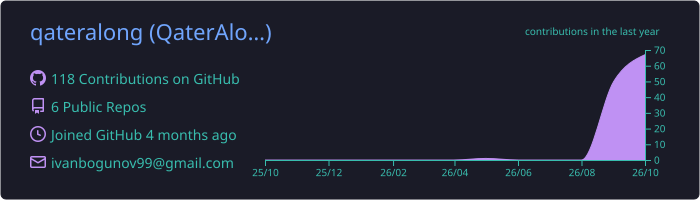
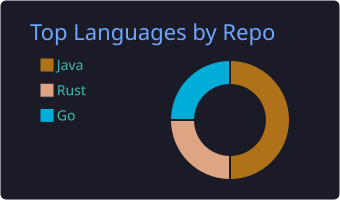
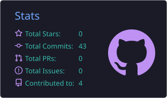

<p align="center">
  
</p>

<p align="center">
  <a href="https://github.com/qateralong"></a>
</p>

<p align="center">
  
  <a href="https://github.com/qateralong?tab=followers"></a>
</p>

---

### 👋 About me

```java
public class QaterAlong {
    String role      = "Junior Developer";
    String[] code    = {"Java", "Python", "JavaScript", "C"};
    String[] likes   = {"AI agents", "3D printers", "Minecraft modding", "Linux"};
    String[] speaks  = {"Русский", "English"};
    String motto     = "If it can move, it can be scripted.";
}
```

### 🛠️ Tech stack

<p align="center">
  
</p>

### 🚀 Featured projects

<table>
  <tr>
    <td width="33%" valign="top">
      <h4>✏️ <a href="https://github.com/qateralong/HandWriter">HandWriter</a></h4>
      <p>Writes text by hand and draws technical drawings (SVG, DXF, PDF, PNG) with a pencil on a Marlin 3D printer — handwriting randomness, GOST frames, multi‑pass sheets.</p>
      
      
    </td>
    <td width="33%" valign="top">
      <h4>🤖 <a href="https://github.com/qateralong/server-ai-agent">server-ai-agent</a></h4>
      <p>Personal AI agent for Linux: JavaFX UI + Telegram bot, Ollama / Claude backends, voice, scripts and long‑term memory.</p>
      
      
      
    </td>
    <td width="33%" valign="top">
      <h4>⛏️ <a href="https://github.com/qateralong/ender-ban">EnderBan</a></h4>
      <p>Paper / Spigot / Folia plugin that blocks configured items from Ender Chests. EN/RU/ES messages, hot reload, Fabric &amp; Forge ports.</p>
      
      
    </td>
  </tr>
</table>

### 📊 GitHub stats

<p align="center">
  
</p>
<p align="center">
  
  
</p>

### 🐍 Contribution snake

<p align="center">
  <picture>
    <source media="(prefers-color-scheme: dark)" srcset="https://raw.githubusercontent.com/qateralong/qateralong/output/snake-dark.svg"/>
    
  </picture>
</p>

---

<p align="center">
  <sub>✨ Thanks for stopping by! Feel free to star a repo or open an issue ✨</sub>
</p>
